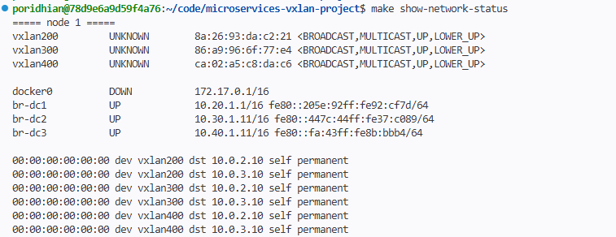
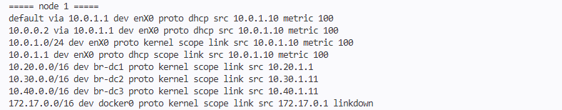
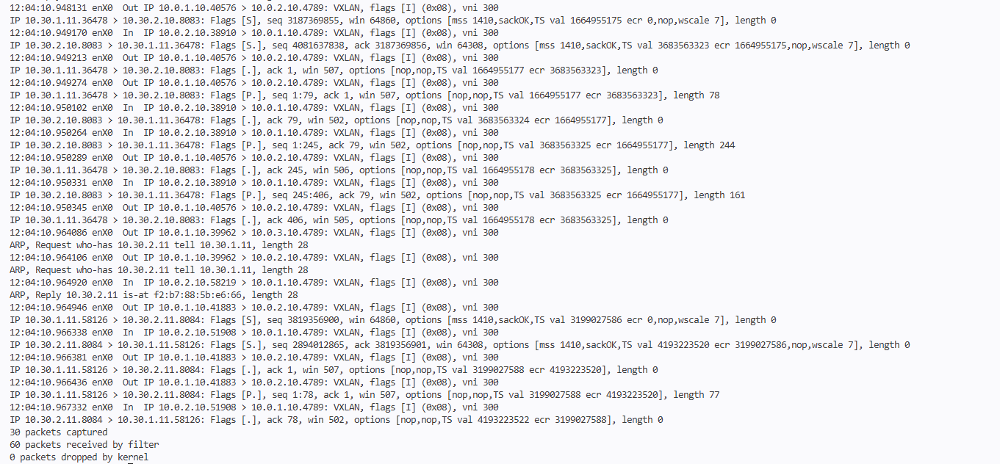

# Network Topology

This page explains how the network is laid out, from the AWS VPC down to the
container IPs, and why each choice was made.

## Two layers

There are two networks, one on top of the other.

**The underlay** is the real AWS network. It connects the three EC2 nodes.

**The overlay** is the container network. It is built from VXLAN tunnels that
run on top of the underlay. Containers only ever see the overlay.

A packet from a container in DC1 to a container in DC3 is wrapped in a UDP packet
on node 1, sent across AWS as normal traffic between `10.0.1.10` and `10.0.3.10`,
and unwrapped on node 3. AWS never sees the `10.20.x.x` or `10.40.x.x` addresses
inside. That is a good thing: AWS does not know those networks and would drop them.

## Underlay (AWS)

| Item | Value |
|---|---|
| Region | `ap-southeast-1` |
| VPC | `10.0.0.0/16` (`mdc-vpc`) |
| Internet gateway | `mdc-igw`, default route `0.0.0.0/0` in `mdc-rtb` |
| Security group | `mdc-sg` |

| Datacenter | Availability zone | Subnet | Node | Private IP |
|---|---|---|---|---|
| DC1 | `ap-southeast-1a` | `10.0.1.0/24` | `dc1-node` | `10.0.1.10` |
| DC2 | `ap-southeast-1b` | `10.0.2.0/24` | `dc2-node` | `10.0.2.10` |
| DC3 | `ap-southeast-1c` | `10.0.3.0/24` | `dc3-node` | `10.0.3.10` |

The node private IPs are fixed, because they are the tunnel endpoints (VTEPs).
Every node needs to know the other two addresses in advance.

Subnets in one VPC can reach each other through the `local` route that AWS adds
by itself, so the three availability zones need no extra routing.

### Security group rules

| Protocol | Port | From | Why |
|---|---|---|---|
| TCP | 22 | `0.0.0.0/0` | SSH from the lab |
| UDP | 4789 | `10.0.0.0/16` | VXLAN between the nodes |
| ICMP | all | `10.0.0.0/16` | ping inside the VPC |
| TCP | 80 | `10.0.0.0/16` | gateway |
| TCP | 8080-8085 | `10.0.0.0/16` | app services |
| TCP | 8500 | `10.0.0.0/16` | discovery |

UDP 4789 is the one that matters most. Close it and the tunnels carry nothing.

## Overlay (VXLAN)

Each datacenter gets its own VXLAN network with its own ID (VNI), its own `/16`,
its own Linux bridge and its own Docker network.

| Datacenter | VNI | Overlay subnet | Gateway | Bridge | Docker network | VXLAN device |
|---|---|---|---|---|---|---|
| DC1 | 200 | `10.20.0.0/16` | `10.20.1.1` | `br-dc1` | `dc1-net` | `vxlan200` |
| DC2 | 300 | `10.30.0.0/16` | `10.30.1.1` | `br-dc2` | `dc2-net` | `vxlan300` |
| DC3 | 400 | `10.40.0.0/16` | `10.40.1.1` | `br-dc3` | `dc3-net` | `vxlan400` |

**All three VXLAN networks exist on all three nodes.** VNI 200 is DC1's network,
but it is stretched to every node. This is what lets one datacenter reach another
without an extra hop (see [Routing between datacenters](#routing-between-datacenters)).

So every node has three bridges and three VXLAN devices: nine of each in total.



### Tiers inside a datacenter

Each `/16` is split into three `/24` ranges, one per tier:

| Tier | DC1 | DC2 | DC3 | Used by |
|---|---|---|---|---|
| Web | `10.20.1.0/24` | `10.30.1.0/24` | `10.40.1.0/24` | gateway, bridge addresses |
| Application | `10.20.2.0/24` | `10.30.2.0/24` | `10.40.2.0/24` | the service containers |
| Data | `10.20.3.0/24` | `10.30.3.0/24` | `10.40.3.0/24` | db and cache stubs |

### Bridge addresses

The node that owns a datacenter holds its gateway address (`.1`). Docker creates
that bridge, as part of the Docker network.

The other two nodes create the bridge by hand and give it a different address,
`.1` followed by `10 + node number`:

| Bridge | node 1 | node 2 | node 3 |
|---|---|---|---|
| `br-dc1` | **`10.20.1.1`** (gateway) | `10.20.1.12` | `10.20.1.13` |
| `br-dc2` | `10.30.1.11` | **`10.30.1.1`** (gateway) | `10.30.1.13` |
| `br-dc3` | `10.40.1.11` | `10.40.1.12` | **`10.40.1.1`** (gateway) |

Why not give all three the same `.1`? Once the tunnel is up, the three `br-dc1`
bridges are one network. Three machines answering for `10.20.1.1` would confuse
ARP, and traffic would go to the wrong node at random.

### Container addresses

Docker picks container IPs on its own, and each node's Docker knows nothing about
the other two. So every container gets a fixed `--ip`. That rules out duplicates,
and it keeps the discovery service's list true.

| DC | Tier | Container | IP | Port |
|---|---|---|---|---|
| DC1 | Web | `dc1-gateway-nginx` | `10.20.1.10` | 80 |
| DC1 | App | `dc1-user-nginx` | `10.20.2.10` | 8080 |
| DC1 | App | `dc1-catalog-nginx` | `10.20.2.11` | 8081 |
| DC1 | App | `dc1-order-nginx` | `10.20.2.12` | 8082 |
| DC1 | Data | `dc1-db-stub` / `dc1-cache-stub` | `10.20.3.10` / `.11` | 80 |
| DC2 | Web | `dc2-gateway-nginx` | `10.30.1.10` | 80 |
| DC2 | App | `dc2-payment-nginx` | `10.30.2.10` | 8083 |
| DC2 | App | `dc2-notify-nginx` | `10.30.2.11` | 8084 |
| DC2 | App | `dc2-order-nginx` | `10.30.2.12` | 8082 |
| DC2 | Data | `dc2-db-stub` / `dc2-cache-stub` | `10.30.3.10` / `.11` | 80 |
| DC3 | Web | `dc3-gateway-nginx` | `10.40.1.10` | 80 |
| DC3 | App | `dc3-user-nginx` | `10.40.2.10` | 8080 |
| DC3 | App | `dc3-catalog-nginx` | `10.40.2.11` | 8081 |
| DC3 | App | `dc3-order-nginx` | `10.40.2.12` | 8082 |
| DC3 | App | `dc3-payment-nginx` | `10.40.2.13` | 8083 |
| DC3 | App | `dc3-notify-nginx` | `10.40.2.14` | 8084 |
| DC3 | App | `dc3-analytics-nginx` | `10.40.2.15` | 8085 |
| DC3 | App | `dc3-discovery-nginx` | `10.40.2.16` | 8500 |
| DC3 | Data | `dc3-db-stub` / `dc3-cache-stub` | `10.40.3.10` / `.11` | 80 |

## MTU: 1450, not 1500

VXLAN adds 50 bytes to every packet:

| Part | Bytes |
|---|---|
| Outer IP header | 20 |
| Outer UDP header | 8 |
| VXLAN header | 8 |
| Inner Ethernet header | 14 |
| **Total** | **50** |

The inner Ethernet header counts because VXLAN carries the whole layer-2 frame,
not just the IP packet. That is also why containers on different nodes believe
they share one LAN.

So the overlay MTU is `1500 - 50 = 1450`. It is set on the VXLAN devices, the
bridges, and the Docker networks (`-o com.docker.network.driver.mtu=1450`).
The last one is what tells the containers to keep their packets small.

If it were left at 1500, small requests would work and large replies would hang,
with no error anywhere. That kind of problem is very hard to trace, so it is set
everywhere from the start.

## MAC learning without multicast

A normal switch learns where each MAC address lives by watching traffic. When it
does not know an address yet, it sends the frame to every port.

VXLAN does the same, but "every port" means "every other node". The textbook
way lists the other nodes with a multicast group. **AWS VPCs do not support
multicast**, so that silently does nothing.

Instead, each VXLAN device gets one line per peer in its forwarding table (fdb):

```
bridge fdb append 00:00:00:00:00:00 dev vxlan200 dst 10.0.2.10
bridge fdb append 00:00:00:00:00:00 dev vxlan200 dst 10.0.3.10
```

The all-zero MAC means "anyone I do not know yet". Unknown traffic is copied to
both peers. Once replies come back, the bridge learns the real addresses as usual.
This is called head-end replication.

The `remote` option of `ip link add ... type vxlan` is not used, because it takes
only one peer, and every node here has two.

Each node ends up with 3 tunnels × 2 peers = 6 fdb lines.

## Routing between datacenters

Each datacenter is its own layer-2 network, so DC1 and DC3 cannot talk directly.
Something has to route between them. Here, **each node is that router.**

Because every node has all three bridges, and every bridge has an address, the
kernel adds a route for each overlay subnet by itself:

```
10.20.0.0/16 dev br-dc1 proto kernel scope link src ...
10.30.0.0/16 dev br-dc2 proto kernel scope link src ...
10.40.0.0/16 dev br-dc3 proto kernel scope link src ...
```

`proto kernel` means nobody wrote these lines by hand. Giving a bridge an address
is what creates them. No address, no route.



### A request from DC1 to DC3, step by step

1. `dc1-user-nginx` (`10.20.2.10`) calls `10.40.2.15`. That is not on its own network,
   so it sends the packet to its gateway, `10.20.1.1`, which is `br-dc1` on node 1.
2. Node 1 looks up `10.40.2.15`, finds `10.40.0.0/16 dev br-dc3`, and passes the
   packet to `br-dc3`. **The datacenter changes here, inside node 1.**
3. `vxlan400` is attached to `br-dc3`, so the frame is wrapped in UDP port 4789 and
   sent from `10.0.1.10` to `10.0.3.10`.
4. AWS delivers it like any other packet inside the VPC.
5. Node 3 unwraps it on its `vxlan400`, and `br-dc3` hands it to `dc3-analytics-nginx`.

The reply takes a different path. The DC3 container sends it to its own gateway,
`10.40.1.1` on node 3. Node 3 routes it to its `br-dc1`, and it travels back over
**vxlan200**. So a request goes out on one tunnel and the reply returns on another.
When watching with `tcpdump`, use `-i any` to see both halves.



### Two settings this depends on

Both fail silently when missing, so both are set by `overlay-up.sh`:

- **`net.ipv4.ip_forward=1`** — without it, Linux does not pass packets from one
  bridge to another.
- **`DOCKER-USER` firewall rules** — Docker drops forwarded traffic on bridges it does
  not know. Each bridge gets an accept rule for traffic in (`-i`) and out (`-o`).
  With only one direction allowed, the request leaves and the reply never returns.

## A correction to the task

The task lists these subnets:

- DC2: `10.300.0.0/16`
- DC3: `10.400.0.0/16`

Each of the four numbers in an IPv4 address is 8 bits, so it can only be 0 to 255.
`300` and `400` do not fit, and every tool (`ip addr add`, `docker network create`)
rejects them.

This project uses `10.30.0.0/16` and `10.40.0.0/16`. The pattern stays the same
(`10.20` → `10.30` → `10.40`, matching VNI 200 → 300 → 400), and nothing else changes.
