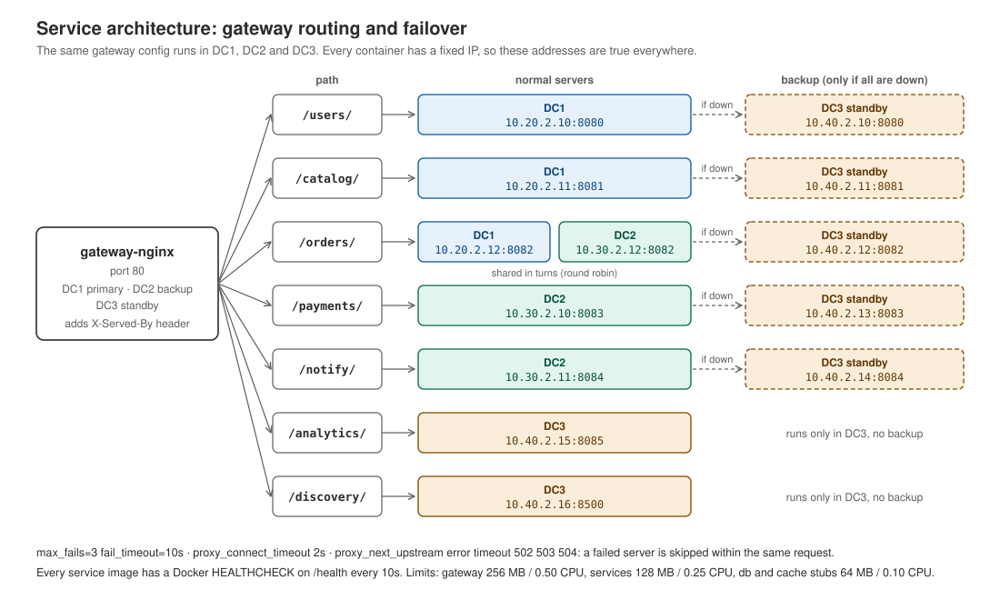

# Service Architecture

## The eight services

Every service is a small nginx container that returns a fixed reply. There is no
real application logic. The point of the project is the network, the failover and
the automation around them.

| Service | Port | Returns |
|---|---|---|
| gateway-nginx | 80 | HTML page `API Gateway - DCx`, and passes requests to the other services |
| user-nginx | 8080 | JSON: user service status |
| catalog-nginx | 8081 | JSON: sample product data |
| order-nginx | 8082 | JSON: order service status |
| payment-nginx | 8083 | JSON: payment service status |
| notify-nginx | 8084 | JSON: notification service status |
| analytics-nginx | 8085 | JSON: sample analytics data |
| discovery-nginx | 8500 | JSON: every service, where it runs, its IP and role |

Every service also answers `/health` with `ok`. Docker uses that for its health check.

A page for each service is in [../docs/services/](../docs/services/).

## Where they run

| Service | DC1 (node 1) | DC2 (node 2) | DC3 (node 3) |
|---|---|---|---|
| gateway-nginx | primary | backup | standby |
| user-nginx | primary | — | standby |
| catalog-nginx | primary | — | standby |
| order-nginx | primary | replica | standby |
| payment-nginx | — | primary | standby |
| notify-nginx | — | primary | standby |
| analytics-nginx | — | — | primary |
| discovery-nginx | — | — | primary |

Each datacenter also runs `db-stub` and `cache-stub`, plain nginx containers that
hold the data-tier addresses. That makes 6 containers in DC1, 6 in DC2 and 10 in DC3.

**DC3 is the safety net.** It has a copy of every service, so any service in DC1 or
DC2 can fail and traffic still has somewhere to go.

## One image, three datacenters

Every reply file contains the placeholder `__DC__` instead of a datacenter name.
When a container starts, a small script (`configs/nginx/40-set-dc.sh`) replaces it
with the value of the `DC` environment variable:

```bash
docker run -e DC=DC1 ... user-nginx     # replies with "datacenter": "DC1"
docker run -e DC=DC3 ... user-nginx     # replies with "datacenter": "DC3"
```

The nginx image runs every script in `/docker-entrypoint.d/` before it starts nginx,
so no custom entrypoint is needed.

This matters for testing: when a reply says `DC3`, you know for sure the backup
answered, not the primary.

## The gateway and load balancing



The gateway does not answer requests by itself. It looks at the path and passes the
request on:

| Path | Goes to | Backup |
|---|---|---|
| `/users/` | DC1 user-nginx | DC3 |
| `/catalog/` | DC1 catalog-nginx | DC3 |
| `/orders/` | DC1 **and** DC2 order-nginx, shared | DC3 |
| `/payments/` | DC2 payment-nginx | DC3 |
| `/notify/` | DC2 notify-nginx | DC3 |
| `/analytics/` | DC3 analytics-nginx | — |
| `/discovery/` | DC3 discovery-nginx | — |

For each service, the gateway has an nginx `upstream` block. For example:

```nginx
upstream order_service {
    server 10.20.2.12:8082 max_fails=3 fail_timeout=10s;   # DC1
    server 10.30.2.12:8082 max_fails=3 fail_timeout=10s;   # DC2 replica
    server 10.40.2.12:8082 backup;                         # DC3 standby
}
```

- The two normal servers share the traffic in turns (round robin).
- `max_fails=3 fail_timeout=10s`: after 3 failures within 10 seconds, nginx stops
  sending to that server for 10 seconds.
- `backup`: this server only gets traffic when every normal server is down.

The same gateway config runs in all three datacenters. Since every container has a
fixed IP, the addresses are true everywhere.


## Failover

Three settings in the gateway make failover fast:

```nginx
proxy_connect_timeout 2s;
proxy_read_timeout    5s;
proxy_next_upstream   error timeout http_502 http_503 http_504;
```

If a server does not answer within 2 seconds, or returns a 502/503/504, nginx tries
the next server **for the same request**. The client does not see an error, only a
slightly slower reply.

The gateway also adds an `X-Served-By` header with the address that answered. When
the first server failed, the header lists both, for example
`10.20.2.10:8080, 10.40.2.10:8080`: tried DC1, answered by DC3.

`make test-failover` shows this happening: it stops `dc1-user-nginx`, checks that
DC3 answers, starts it again, and checks that traffic returns to DC1.


## Service discovery

`discovery-nginx` returns a static JSON list of every service, its port, and each
copy with its datacenter, IP and role (primary, replica, backup, standby).

It is static on purpose. Every container has a fixed IP, so the list cannot go out
of date unless the IP plan itself changes. Any service or script can read it at
`http://10.40.2.16:8500/`, or through a gateway at `/discovery/`.

## Health checks

Every service image has a Docker health check:

```dockerfile
HEALTHCHECK --interval=10s --timeout=3s --start-period=5s --retries=3 \
    CMD wget -q -O /dev/null http://127.0.0.1:<port>/health || exit 1
```

Docker calls `/health` every 10 seconds. Three misses in a row mark the container
`unhealthy`. `make health-check` shows the state of every container.


## Resource limits

| Container | Memory limit | Memory reservation | CPU limit |
|---|---|---|---|
| gateway-nginx | 256 MB | 128 MB | 0.50 |
| every other service | 128 MB | 64 MB | 0.25 |
| db-stub, cache-stub | 64 MB | 32 MB | 0.10 |

The limit is a hard ceiling. The reservation is what the container is promised when
the node runs short of memory. These are small numbers on purpose: the nodes are
`t2.micro` with 1 GB of memory, and DC3 runs ten containers.

All containers use `--restart unless-stopped`, so they come back after a crash or a
node reboot, but stay down if they were stopped on purpose.
