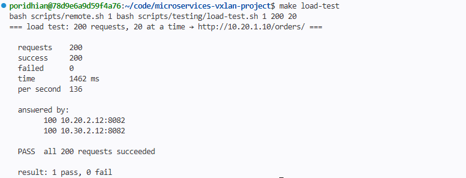

# Order Service (`order-nginx`)

Reports the status of the order service, with open orders and orders shipped today. It is the only service that runs as two active copies: DC1 and DC2 share the traffic.

## At a glance

| | |
|---|---|
| Port | `8082` |
| Health check | `GET /health` → `ok` |
| Through a gateway | `http://<gateway>/orders/` |
| Memory limit / reservation | 128 MB / 64 MB |
| CPU limit | 0.25 |

## Where it runs

| Datacenter | Container | IP | Role |
|---|---|---|---|
| DC1 | `dc1-order-nginx` | `10.20.2.12` | primary |
| DC2 | `dc2-order-nginx` | `10.30.2.12` | replica |
| DC3 | `dc3-order-nginx` | `10.40.2.12` | standby |

## Load sharing

The gateway sends `/orders/` to DC1 and DC2 in turns. `make load-test` targets this route and shows how many requests each copy answered.



## Example reply

From `dc1-order-nginx`:

```json
{
  "service": "order-nginx",
  "status": "up",
  "datacenter": "DC1",
  "port": 8082,
  "orders": {
    "open": 18,
    "shipped_today": 57
  }
}
```

The datacenter name is filled in when the container starts, from `-e DC=...`.
The same image gives a different name when it runs in another datacenter.

## Try it

From the lab container, through node 1:

```bash
bash scripts/remote.sh 1 curl -s http://10.20.2.12:8082/
bash scripts/remote.sh 1 curl -s http://10.20.2.12:8082/health
```

## Files

| File | Purpose |
|---|---|
| `dockerfiles/Dockerfile.order-nginx` | builds the image |
| `configs/nginx/order-nginx.conf` | port, reply and `/health` |
| `data/service-responses/order-nginx/index.json` | the reply |
| `configs/nginx/40-set-dc.sh` | puts the datacenter name into the reply at start |
