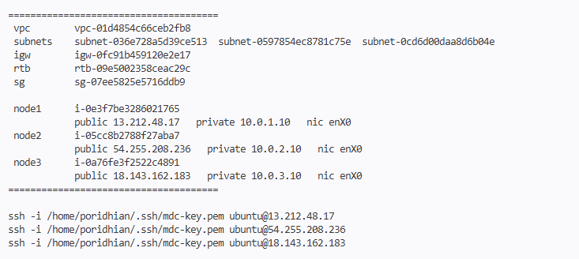
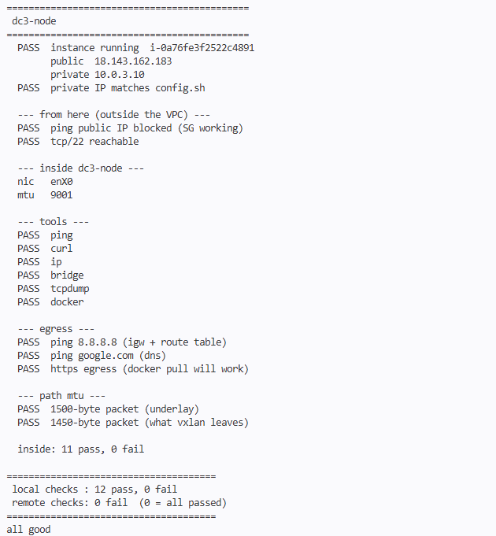
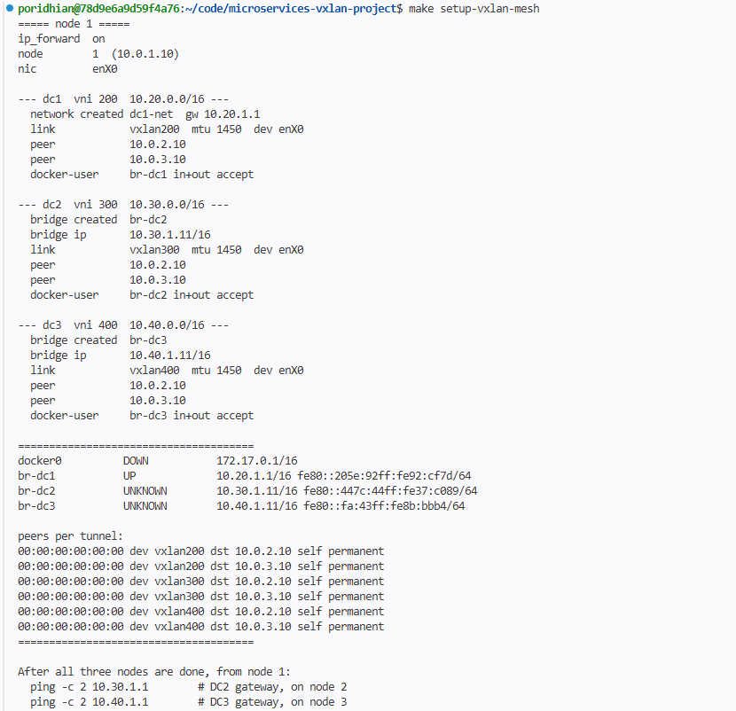
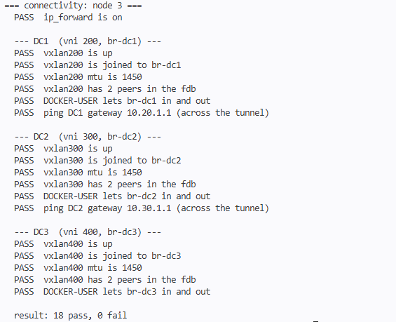
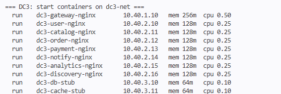
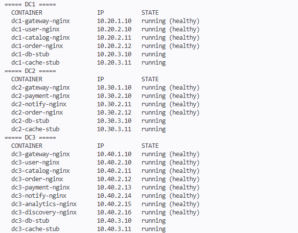
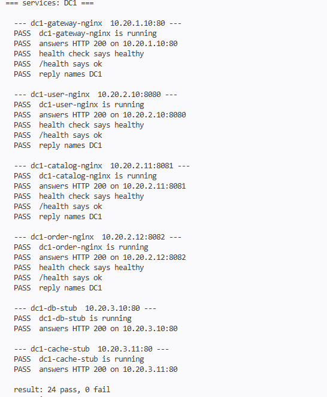
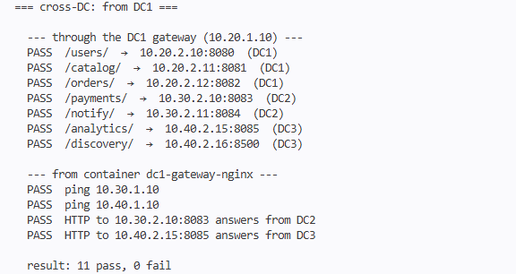
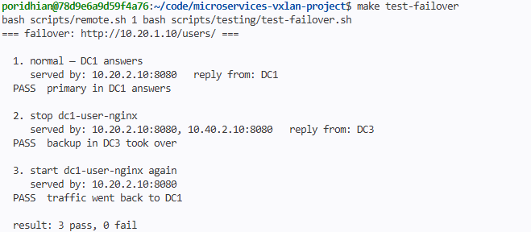

# Setup Guide

This guide takes you from an empty AWS account to all 22 containers running and
tested. Every command runs from the project folder in the lab container, unless it
says otherwise.

Plan for about an hour. Most of that is waiting for EC2 nodes and Docker images.

## 0. Before you start

You need:

- the AWS CLI, with credentials for a lab that allows EC2
- `make`, `ssh`, `tar` and `curl` in the lab container
- this project folder in the lab container

Set up the AWS CLI and check it works:

```bash
aws configure                      # region: ap-southeast-1, output: json
aws sts get-caller-identity        # should print your account and ARN
```

If `make` is missing:

```bash
sudo apt-get update && sudo apt-get install -y make
```

If you copied the project from a Windows machine, check that the scripts have Linux
line endings. This command fixes them if they do not:

```bash
find . -name '*.sh' -exec sed -i 's/\r$//' {} +
```

## 1. Build the AWS infrastructure

```bash
make setup-infrastructure
```

This runs two scripts:

- `provision.sh` creates the VPC, three subnets in three availability zones, the
  internet gateway, route table, security group, SSH key and three EC2 nodes, then
  waits until SSH works on all of them. It takes 5 to 10 minutes.
- `push-project.sh` copies this project to every node and installs `docker`,
  `tcpdump`, `ping` and `curl`.

At the end you see a summary with the IDs and IPs:



## 2. Check the nodes

```bash
make validate-infrastructure
```

It checks each node from outside (running, private IP correct, SSH open, ping from
the internet blocked) and from inside (tools, internet, DNS, HTTPS, MTU).

The last lines should read:

```
 local checks : 12 pass, 0 fail
 remote checks: 0 fail  (0 = all passed)
all good
```



If a tool shows as missing, run `make push-project` again without `--no-tools`:
`bash scripts/infrastructure/push-project.sh`.

## 3. Build the VXLAN mesh

```bash
make setup-vxlan-mesh
```

On each node, `overlay-up.sh` turns on IP forwarding and then, for each of the three
datacenters, creates the bridge (or the Docker network on its own node), the VXLAN
device, the two fdb peers and the firewall rules.

Check the first lines for each node. They must show the right node number:

```
node        1  (10.0.1.10)
nic         enX0
```



To look at the result:

```bash
make show-network-status
make show-routing-table
```

## 4. Test the network before adding containers

```bash
make test-connectivity
```

Every line should be PASS. The most important ones are the pings to the other
datacenters' gateways, because they cross the tunnels.



**If this fails, stop and fix it before going on.** Nothing built on top will work.
See [troubleshooting.md](troubleshooting.md).

## 5. Deploy the services

```bash
make deploy-services
```

For each datacenter, on its own node, this builds the images it needs and starts
its containers with fixed IPs, memory and CPU limits, and the datacenter name.
The first run takes a few minutes, mostly pulling `nginx:alpine` and building.



Wait about 20 seconds for the health checks, then:

```bash
make health-check
```

Every container should show `running (healthy)`. The db and cache stubs have no
health check, so they show just `running`.



## 6. Test everything

```bash
make test
```

This runs three suites on every node:

- `test-connectivity` — the network again
- `test-services` — each container runs, is healthy, answers, and names its DC
- `test-cross-dc` — every gateway route, and direct calls between datacenters





Two more tests to run on their own:

```bash
make test-failover     # stops DC1 user-nginx, DC3 takes over, DC1 comes back
make load-test         # 200 requests, 20 at a time; try REQUESTS=1000 PARALLEL=50
```




## 7. See the VXLAN traffic

Open a second terminal, log in to any node, and watch the tunnel:

```bash
sudo tcpdump -ni any udp port 4789
```

Run `make test-cross-dc` in the first terminal. You will see UDP packets between the
node IPs (`10.0.x.10`), marked `VXLAN ... vni 200/300/400`, with the container
addresses (`10.20/30/40.x.x`) inside.


To log in to a node: `provision.sh` prints the SSH commands at the end, or run
`bash scripts/remote.sh 1 hostname` to check the connection.

## 8. Clean up

```bash
make cleanup-infrastructure
```

This deletes the nodes and every AWS resource the project created. Containers,
tunnels and bridges go away with the nodes.

## All in one

Steps 1 to 6 in a single command:

```bash
make all
```
